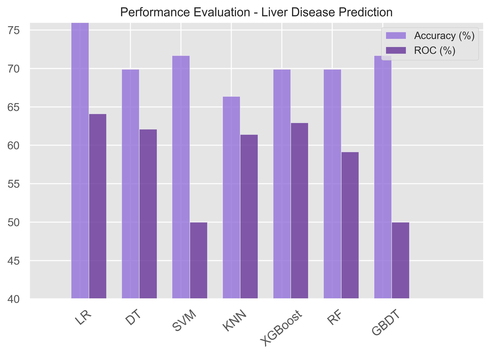

# Liver Disease Prediction Using Machine Learning Models

## Project Overview

This project explores the use of various machine learning models to predict the likelihood of liver disease. The dataset contains health metrics, and the models aim to classify whether a person has liver disease (1) or not (0). 

## Features

- **Binary Classification**: Predict whether the patient has liver disease.
- **Data Preprocessing**: Handles missing values, encodes categorical variables, and performs outlier removal.
- **Exploratory Data Analysis (EDA)**: Visualizes health indicators with histograms, boxplots, and correlation heatmaps.
- **Machine Learning Models**: Trains and evaluates models including Logistic Regression, KNN, Decision Tree, Random Forest, XGBoost, SVM, and Gradient Boosting.
- **Hyperparameter Tuning**: Uses GridSearchCV to optimize model performance.

## Dataset

- **Liver Disease Dataset** (`liver.csv`): Contains various health-related features to predict liver disease.

## Requirements

- **Python 3.10**
- **Pandas**
- **NumPy**
- **Scikit-learn**
- **XGBoost**
- **Matplotlib**
- **Seaborn**

## Installation

1. **Clone the Repository:**

    ```bash
    git clone https://github.com/Tanjim-Islam/Liver-Disease-Prediction-Using-Machine-Learning-Models.git
    cd Liver-Disease-Prediction-Using-Machine-Learning-Models
    ```

2. **Install Dependencies:**

    ```bash
    pip install pandas numpy scikit-learn xgboost matplotlib seaborn
    ```

3. **Ensure the Dataset is Available:**
   Place `liver.csv` in the working directory.

## Code Structure

1. **Data Preprocessing:**
   - Handle missing values using appropriate strategies.
   - Encode categorical features like gender.
   - Remove outliers based on domain-specific thresholds.

2. **Exploratory Data Analysis (EDA):**
   - Use histograms, box plots, and correlation heatmaps.

3. **Model Training and Evaluation:**
   - Train and evaluate:
     - Logistic Regression
     - K-Nearest Neighbors (KNN)
     - Support Vector Machine (SVM)
     - Decision Tree
     - Random Forest
     - XGBoost
     - Gradient Boosting

## Results

### Model Accuracy Comparison:

| **Model**                     | **Training Accuracy (%)** | **Testing Accuracy (%)** |
|-------------------------------|---------------------------|--------------------------|
| Logistic Regression (LR)      | 71.18                     | 76.99                    |
| K-Nearest Neighbors (KNN)     | 71.18                     | 66.37                    |
| Support Vector Machine (SVM)  | 71.18                     | 71.68                    |
| Decision Tree (DT)            | 100.00                    | 69.91                    |
| Random Forest                 | 90.02                     | 69.91                    |
| XGBoost                       | 93.79                     | 69.91                    |
| Gradient Boosting             | 71.18                     | 71.68                    |

### Performance Evaluation Plot:

A bar plot comparing the **accuracy** and **ROC-AUC** scores of various models:



### ROC Curves:

ROC curves showing the trade-off between sensitivity and specificity for each model:


